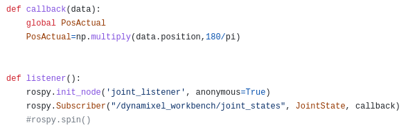

## Laboratorio 4 Robótica
### Integrantes: 
- Danilo Enrique Insuasty Delgado.
- Abraham Másmela Ramirez.
- Nicolás Prieto Solano.

## Objetivos:
• Crear todos los Joint Controllers con ROS para manipular servomotores Dynamixel AX-12 del robot Phantom X Pincher.  
• Manipular los tópicos de estado y comando para todos los Joint Controllers del robot Phantom X Pincher.  
• Manipular los servicios para todos los Joint Controllers del robot Phantom X Pincher.  
• Conectar el robot Phantom X Pincher con MATLAB o Python usando ROS.  

## Parametros DH del robot Pincher
El diagrama que describe el robot pincher es el siguiente

Los marcos de referencias para describir el robot a traves de los parametros DH con base en el diagrama del robot pincher y las distancias de las articulaciones ya medidas son:

La tabla con los parametros DH se muestra a continuación

Con los parametros DH se pueden contruir las matrices que describen cada eslabon respecto al otro. Las siguientes son las matrices de cada eslabon

La matriz de la herramienta es la siguiente. La distancia medida entre el centro del griper y es eslabon es de 1cm.

la matriz de transformación homogénea desde la base hasta el efector final que es la multiplicacion consecutiva de las matrices mostradas anteriormente es:

donde:

El robot contruido con las herramientas SerialLink de matlab se ve de la siguiente forma

Sin embargo la pose Home es cuando el robot se encuentra completamente vertical, es por eso que desde ahora la posicion inicial tiene la siguiente forma.

Teniendo en cuenta las diferentes poses requeridas descritas en las siguiente tabla. 

| Pose | Valores articulares(grados) |
|------|---------------------|
| 1   | 0, 0, 0, 0, 0.       |
| 2   | -25, 15, -20, 20, 0 |
| 3   | 35, -35, 30, -30, 0 |
| 4   | -85, 20, -55, 17, 0|
| 5   | -80, 35, -55, 45, 0|

Se grafican dichas posiciones en el robot hecho en Matlab. Las posiciones 1(home), 2, 3, 4 y 5 son respectivamente

<h2>Codigo:</h2>

En primer lugar se ajusta la configuracion de los motores dentro del archivo de configuracion de dynamixel one motor provisto en la pagina del curso, creando dentro de esta los ajustes para los 5 motores que componen al pincher, con este archivo ya creado se pasa al codigo de python donde se importan las siguientes dependencias.

 El modulo de rospy para el funcionamiento general de ROS dentro de python, numpy para realizar operaciones matematicas dentro del codigo y varios topicos y mensajes propios de ROS.

La funcion de Join_publisher es la encargadad de inizializar un objeto puplisher con el tema de joint_trajectory que es utilizado dentro del objeto de la clase Publisher creado luego, se entra en un ciclo siempre que rospy no se haya apagado, posteriormente se envian los puntos de guardados al motor, esta funcion es una funcion remanente de pruebas anteriores y no se usa dentro del codigo principal del programa.

 Las funciones callback y listener se encargan de recibir y procesar datos obtenidos de los servomotores del manipulador, para el caso de listener se inizializa el nodo que representa al codigo de python dentro del entorno de ROS, ademas de suscribirlo al topico de los estados de las articulaciones del robot, para el caso de la funcion de callback se crea una variable global que puede ser utilizada por fuera de la funcion, siendo esta definida como la multiplicacion de un dato recibido por lo 180/pi lo que transforma una entrada en radianes a grados.

La funcion jointCommand es una funcion que espera a que el servicio de transmitir al motor este disponible, y en cuanto esto pase se intenta enviar el un comando de dynamixel definido como un servicio del entorno de dynamixel, este comando tiene como datos de entrada un numero de comando, un identificador para el motor al que se refiere, el nombre de la direccion de la memoria que debe de modificar el comando y finalmente el valor nuevo que tomara esta posicion de la memoria. Una vez enviado se da un tiempo de espera para ROS y retorna el resultado de la instruccion enviada al manipulador.

Se entra a la parte del codigo que sera ejecutada al llamar al archivo desde la consola de comandos, se ejecuta la funcion de listener para inicializar el nodo de ROS y la recepcion de datos enviados por los motores, se imprimen en consola los datos del grupo. Luego se guardan en varias listas las posiciones disponibles para enviar tanto en sus valores de bits como en sus valores en grados, creando luego una lista de listas de las posiciones disponibles, se muestran por pantalla al usuario las posiciones disponibles en sus valores en grados.

Se entra al ciclo while que durara durante toda la ejecucion del programa, donde se le pide al usuario digitar un numero de posicion para mandar al pincher, dentro de un ciclo for se envian mediante la funcion join_command las instrucciones a cada uno de los motores de manera individual junto con un torque limite con motivos de precaucion, la posicion real del motor es mostrada en consola al lado del error que tiene con respecto a la posicion ideal del motor.

                                                     
																										
 
                                            
                                                       
## Desarrollo:
Se realizan las siguientes poses generadas a partir de los valores articulares de q1, q2, q3, q4, q5.  

A continuación se muestran las posiciones, teniendo en cuenta que nuestro **Home** fue tomado con los valores articulares de 0, 0, 0, 0, 0,  : 
• Posiciones del robot:

  

    
    
    
    
    
  

  

    Posición 1-Home, 2, 3, 4 y 5.
  

A continuación se muestra el video donde el robot alcanza cada una de las posiciones que son seleccionadas por el usuario:

  

La comparación de las posiciones reales y las realizadas en Matlab:

 

## Conclusiones:
• Aunque la interfaz podría mejorarse en futuros laboratorios, el programa desarrollado cumple su función de comunicación humano-máquina a través de la terminal. Se espera poder implementar una interfaz más amigable en futuros trabajos.  
• Los repositorios de referencia fueron fundamentales para el desarrollo de este laboratorio. Si bien se consideraron otros trabajos, se decidió utilizar los archivos incluidos en la carpeta de Dynamixel One Motor, específicamente los tres códigos de la carpeta de scripts. Esto permitió una mayor eficiencia en el desarrollo del programa y una mejor comprensión de los conceptos involucrados en el control de motores Dynamixel.  

